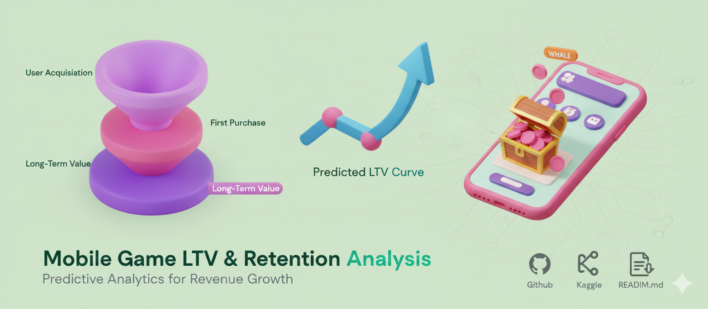

# Mobile Game LTV & Retention Analysis 
Predicting in-app purchase revenue and understanding user behavior in mobile gaming
# 🎮 Mobile Game LTV & Retention Analysis  
*Predicting in-app purchase revenue and understanding user behavior in mobile gaming*

---

## 📌 Project Overview

This project focuses on **predicting user spending behavior (LTV)** in a mobile game using behavioral, demographic, device, and gameplay features.

We explore:

- Which users have **high revenue potential**?
- Which features **impact in-app spending** the most?
- How gameplay behavior shapes **monetization & retention**?
- What patterns can help marketing & product teams increase LTV?

Türkçe özet:  
Bu proje mobil bir oyunda kullanıcıların gelecekte yapacağı harcamaları (Lifetime Value – LTV) tahmin etmeye ve kullanıcı davranışlarını analiz etmeye odaklanır. Geliri etkileyen faktörler belirlenmiş ve makine öğrenmesi ile tahmin modeli kurulmuştur.

---

## 📁 Dataset

Each row represents one player and includes:

### **Demographic Features**
- Age  
- Country  
- Gender  

### **Device Information**
- Device type (Android / iOS)  
- Payment method  

### **Gameplay Behavior**
- Session count  
- Average session length  
- First purchase delay  
- Game genre  

### **Target Variable**
- `InAppPurchaseAmount` — total money spent by the player  

---

## 🛠️ Project Pipeline

The entire project follows a clean and modern ML workflow:

---

## **1️⃣ Exploratory Data Analysis (EDA)**

We performed:

✔ Missing value analysis  
✔ Outlier detection and capping  
✔ Numerical & categorical feature analysis  
✔ Target-variable relationships  
✔ Spearman correlation analysis  
✔ Visualizations (heatmap, distributions, session/purchase patterns)

---

## **2️⃣ Data Cleaning**

- Missing numerical values → filled with **median**
- Missing categorical values → filled with **mode**
- Outliers → handled using **IQR method**
- Data safely copied to avoid mutation (`df1 = df.copy()`)

---

## **3️⃣ Feature Engineering**

Created advanced features such as:

### **Engagement Features**
- `SessionsPerDay`
- `SessionLengthCategory`
- `IsHeavySessionUser`

### **Purchase Behavior**
- `IsHighSpender`
- `PurchaseFrequency`
- `PurchaseDelayGroup`

### **Demographic Segmentation**
- `AgeGroup`
- `CountryRegion` (EMEA, APAC, LATAM, NA, Other)

These features significantly improved predictive signal.

---

## **4️⃣ Encoding & Scaling**

- One-Hot Encoding (`pd.get_dummies`)
- StandardScaler for numerical features  
- Ensured target variable **not scaled**

---

## **5️⃣ Machine Learning Models**

Evaluated 12+ regression models:

| Model | Type |
|-------|------|
| Linear Regression | Baseline |
| Ridge / Lasso / ElasticNet | Regularized linear models |
| KNN Regressor | Instance-based |
| CART | Decision Tree |
| RandomForest | Ensemble |
| Gradient Boosting | Ensemble |
| XGBoost | Advanced boosting |
| LightGBM | Fast boosting |
| CatBoost | Categorical boosting |
| SVR | Kernel method |

---

## **6️⃣ Cross-Validation Results**

10-fold CV used to compare model performance across RMSE scores.  
Random Forest, LightGBM, CatBoost performed best.

---

## **7️⃣ Hyperparameter Optimization**

Performed GridSearchCV on:

- RandomForest  
- GradientBoosting  
- LightGBM  
- CatBoost  

Selected best parameters and retrained optimized models.

---

## **8️⃣ Feature Importance**

Visualized feature importance for top-performing models:

- Random Forest  
- Gradient Boosting  
- LightGBM  
- CatBoost  

These insights help game teams understand which behaviors drive monetization.

---

## 📊 Key Insights (Summary)

### 🎯 Players who spend more tend to:
- Have **longer play sessions**
- Purchase earlier after installing the game
- Belong to **Young Adult** age group
- Use regions **EMEA & APAC** more frequently
- Play certain game genres (e.g., Strategy, MOBA)
- Have higher session frequency (`SessionsPerDay`)

---

## 🚀 Final Results

The optimized model achieved:

- **High R² score**
- **Low test RMSE**
- Strong generalization performance
- Meaningful feature insights for retention & monetization

This model can be directly used for **LTV prediction, user segmentation, upsell targeting, and churn prevention**.

---

## 📌 Technologies Used

- Python  
- Pandas, NumPy  
- Scikit-Learn  
- XGBoost  
- LightGBM  
- CatBoost  
- Seaborn / Matplotlib  
- Machine Learning Pipelines  
- Hyperparameter Optimization  

---

---

## 🧑‍💻 Author

**Büşra Telli**  
Data Scientist • Machine Learning Enthusiast  

---

---

## 📮 Contact

If you want help understanding the code or want to collaborate, feel free to reach out!

---

✨ *Thank you for reading — contributions & feedback are welcome!*  
